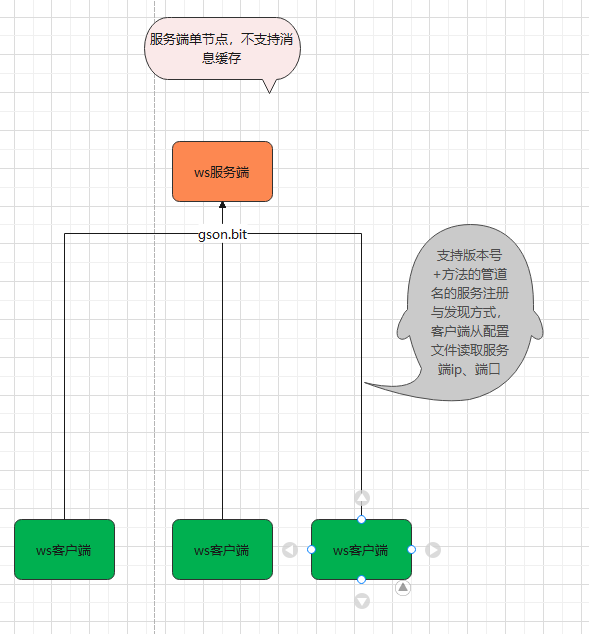
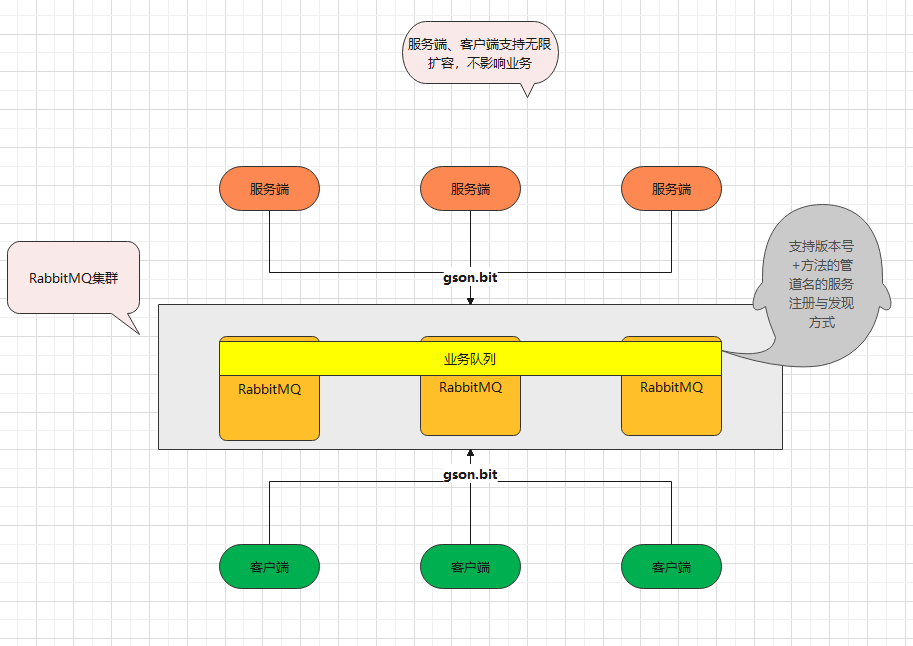
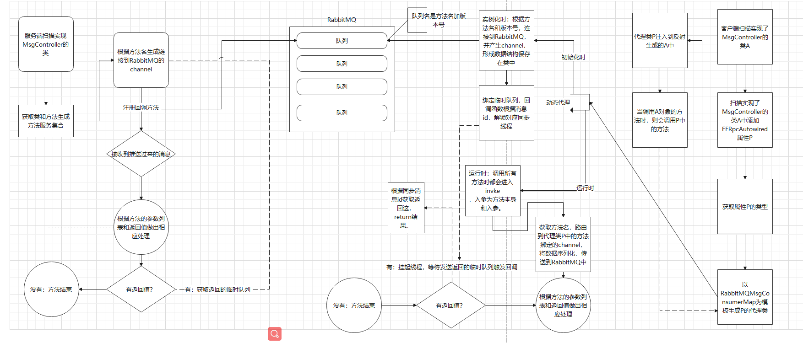
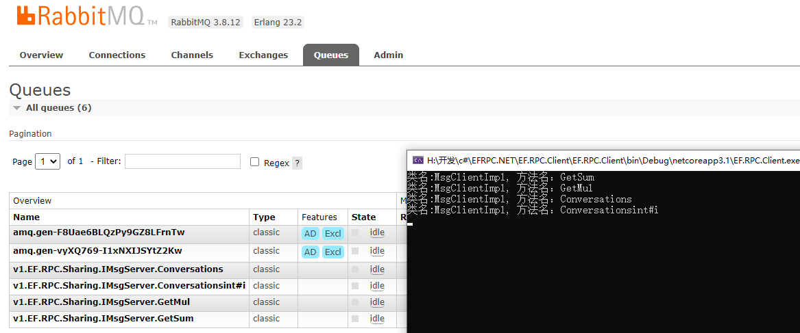

# EFRPC.NET

## 介绍
EFRPC.NET是EF家族的一员，本人追求简单高效，所以EF的意思是easyFast。RPC的意思是的远程服务调用称呼。

#### EFRPC.NET功能介绍
EFRPC.NET是一种C#全方位适配的简化服务调用、解耦、轻量级的RPC框架

EFRPC.NET实现了注解驱动的服务引用和服务提供的框架

EFRPC.NET只需依赖Emit（IL字节码的生成、执行框架）和通信的框架，只仅仅实现了Emit框架生成IL字节码，实现了动态代理。

EFRPC.NET具有Spring一样IOC容器ID，AOP

EFRPC.NET的通讯模块尽量选用RabbitMQ的RPC模式，WebSocket实现了服务端后选型被放弃，客户端放弃了维护

# 注意！！！RabbitMQ的RPC模式并未实现到方法级别，与GRPC和Dubbo等服务调用框架相比完全不是一个量级上的，不要取表面意思理解

#### EFRPC.NET架构简介

分布式事务整体角色分为客户端（Client），服务端（Sever），注册中心不一定存在（使用带缓存的通信协议会有，中间件的服务天然成为了注册中心）

集群特性：

以RabbitMQ通讯协议为例：

客户端（Client）（生产者-》注册队列），服务端（Sever）（消费者-》消费队列），注册中心（RabbitMQ）

服务的注册:以版本号和共享接口函数全名为队列名，注册队列

服务的发现:以版本号和共享接口函数全名为队列名，消费/引用队列

服务的负载均衡：RabbitMQ自身来管理

#### EFRPC.NET开发框架

C#+Emit

通讯协议

第一种：WebSocket

第二种：RabbitMQ的RPC模式，首选！

框架设计本身对协议的耦合度非常低，天然可以替换任何通讯协议，甚至封装其他RPC框架或者


## 软件架构
### websocket协议


### RabbitMQ rpc协议


## 安装教程

1.编译


2.项目引用Impl和Protobuf包，或者工程直接引用这个项目

## 使用说明

EFRPC.NET实现：

1.编写统一的Sharing动态库


2，准备阶段

客户端和服务端都需要实现MsgController

服务端使用注解[EFRpcService(version ="v1.")]

```
 [EFRpcService(version ="v1.")]
    public class MsgServiceImpl: IMsgServer, MsgController
    {
        public  GetMsgSumReply GetSum(GetMsgNumRequest request)
        {
          
                var result = new GetMsgSumReply();

                result.Sum = request.Num1 + request.Num2;

                Console.WriteLine(request.Num1 + "+" + request.Num2 + "=" + result.Sum);

                return result;
           

        }
    }
```
客户端实现类加注解
```
 public class MsgClientImpl : IMsgClient, MsgController
    {
        [EFRpcAutowired(version = "v1", runMode="Auto")]
        public IMsgServer ServiceAutoUpdate;
        //[EFRpcAutowired(version = "AutoUpdate", runMode = "Auto")]
        //public IMsgServer ServiceAutoUpdate2;
        //[EFRpcAutowired(version = "AutoUpdate", runMode = "Auto")]
        public IMsgServer ServiceAutoUpdate3;

       
        public  int GetMul(int num1, int num2)
        {
          
           return ServiceAutoUpdate.GetMul(new GetMsgNumRequest() { Num1 = num1, Num2 = num2 }).Mul;
        }
       
        public int GetSum(int num1, int num2)
        {
            return ServiceAutoUpdate.GetSum(new GetMsgNumRequest() { Num1 = num1, Num2 = num2 }).Sum;
        }
    }
```
3，启动阶段

服务端
```
 new ConsumerBootstrap<Program>().start(new RabbitMQOptionsFactory<RabbitMQMsgConsumerMap>());
```
客户端
```
 MsgClientImpl msgClientImpl= new ProducerBootstrap<Program>().start(new RabbitMQOptionsFactory<RabbitMQMsgProducerMap>()).getController<MsgClientImpl>();
```
## 实现原理
#### EFRPC.NET
<<<<<<< HEAD
=======

整体实现的流程图：


>>>>>>> 652ab0de8efe4d3e837a905caccdf97097b61de9

1，基于字节码的动态代理Emit（IL字节码的生成、执行框架），类似java的cglib；针对客户端实现服务代理类

2，基于反射实现动态代理，将服务端地方法切入协议实现的方法中，使用实现协议的类，代理服务；针对所有实现了MsgController的代理类

3.IOC容器：依据Program或者其他入口类扫描向下引用方法区，反射原理，获取实现MsgController接口的实体类.class，通过1,2 生成代理对象添加到容器中

 
 一级缓存：DynamicProxyFactory，生产单例和缓存单例
 
 二级缓存：LinkMap+MsgMathsInfoFactory
 
 没有代理对象工厂的使用场景和需求，所以没有三级缓存
 

4.DI部分，IOC容器初始化类完成后，扫描实现了MsgController接口的实体类，中标记了EFRpcAutowired属性，依据属性类型去IOC找实例化的对象，注入属性中

5，生产者-》客户端通讯的实现原理：拼接队列名，将请求的入参载入Msg-》GSON.BIT发送到rabbit队列，同时监听临时队列回调唤醒对应生产线程，执行后续操作。

以下为部分代码

```
 IConnection connection = factory.CreateConnection();

                    IModel channel = connection.CreateModel();
                    mfs.channel = channel;
                    if (md.ReturnType != typeof(void))
                    {
                        mfs.initUnsafeSynchronizer();
                        String correlationId = mfs.ReqFullName;
                        // 创建一个临时队列, 返回队列的名字
                        String replyQueue = channel.QueueDeclare().QueueName;

                        IBasicProperties properties = channel.CreateBasicProperties();
                        properties.ReplyTo = replyQueue;
                        properties.CorrelationId = correlationId;
                        mfs.properties = properties;
                        //创建消费者用于消息回调
                        var callbackConsumer = new EventingBasicConsumer(channel);
                        //绑定临时队列的消费
                        channel.BasicConsume(queue: replyQueue, autoAck: true, consumer: callbackConsumer);

                        callbackConsumer.Received += (model, ea) =>
                        {
                            if (ea.BasicProperties.CorrelationId == correlationId)
                            {
                            //解码反回消息
                                SuperMsgMulti superMsg = this.serializer.DeSerializeBytes<SuperMsgMulti>(ea.Body.ToArray());
                                mfs.setMsg(superMsg);
                                mfs.release(superMsg.Id);
                                //var responseMsg = $"Get Response: {Encoding.UTF8.GetString(ea.Body.ToArray())}";
                                //Console.WriteLine($"[x]: {responseMsg}");
                            }
                        };
                    }

```
5，消费者-》服务端通讯的实现原理：拼接队列名，向rabbit注册队列名，回调函数接受GSON.BIT-》MSG，

MSG-》反射获取的入参表传入service，走服务端service业务逻辑，如果有返回值，则取临时队列，将

service返回值以客户端类似的方式传入临时队列。

以下为部分代码
```
 IModel channel = conection.CreateModel();
                        channel.QueueDeclare(queue: this.version+this.interfaceFullName + "." + md.Name, durable: false,
                            exclusive: false, autoDelete: false, arguments: null);
                        var consumer = new EventingBasicConsumer(channel);
                        Console.WriteLine("[*] Waiting for message.");
                        consumer.Received += (model, ea) =>
                        {
                            var properties = ea.BasicProperties;
                            var replyProerties = channel.CreateBasicProperties();
                            replyProerties.CorrelationId = properties.CorrelationId;
                         
                            string s = ea.Body.ToString();
                            SuperMsgMulti superMsg = this.serializer.DeSerializeBytes<SuperMsgMulti>(ea.Body.ToArray());
                            //Console.WriteLine(superMsg.msg[0].ToString());
                            if (null != superMsg.msg&& superMsg.msg.Length>0)
                            {
                                object[] objs = new object[superMsg.msg.Length];
                                for (int j = 0; j < superMsg.msg.Length; j++)
                                {
                                    //mfs.reqs.Length
                                    objs[j] = this.serializer.DeSerializeString(mfs.reqs[j],superMsg.msg[j].ToString());
                                }
                                object rep = mfs.methodInfo.Invoke(this.ControllerObj, objs);
                                if (md.ReturnType != typeof(void))
                                {
                                    channel.BasicPublish(exchange: "", routingKey: properties.ReplyTo,
                                    basicProperties: replyProerties, body: this.serializer.SerializeBytes(superMsg.setReq(rep)));//ProtobufSerializer.SerializeBytes(mfs.rep,rep)
                                }
                            }
                            channel.BasicAck(ea.DeliveryTag, false);
                            // Console.WriteLine($"Return result: {"消息：" + message}");

                        };
                        channel.BasicConsume(queue: this.version+this.interfaceFullName + "." + md.Name, autoAck: false, consumer: consumer);
                        Console.WriteLine($"类名:{ t.Name}, {"方法名：" + md.Name},{"返回值" + ":" + md.ReturnType}");

```
6，同步器：参考了java-》J.U.C中的Synchronizer，主要用来同步客户端的请求调用

框架使用  public ConcurrentDictionary<string, UnsafeSynchronizer> uscd;缓存请求id与Synchronizer的映射

使用AQS类似的接口同步挂起和中断释放请求线程，保证开发者使用接口的隔离性
```
 public abstract class Synchronizer
    {
        protected Thread t;
        protected int sleeptime =0;
        public Synchronizer() {
             t = Thread.CurrentThread;
        }
        public Synchronizer(int i) : this()
        {
            sleeptime = i;
           
        }
        public  void acquire()
        {
            if (tryAcquire()) {
                try
                {
                    if (sleeptime > 0) { Thread.Sleep(sleeptime); }
                    else
                    {
                        ///永久堵塞
                        Thread.Sleep(Timeout.Infinite);
                    }
                }
                catch (ThreadInterruptedException)
                {
                    //被中断消息唤醒
                } 
            }
        }
        public  bool release()
        {
            if (tryRelease())
            {
                unparkSuccessor(t);
                return true;
            }
            return false;
        }

        private void unparkSuccessor(Thread t)
        {
            if (t.ThreadState == ThreadState.WaitSleepJoin) {
                t.Interrupt();
            }
        }
        //<exception cref = "Exception" >1111</ exception >
        public abstract bool tryRelease();
        public abstract bool tryAcquire();
    }
    //[Obsolete("逻辑不安全的同步器,可能造成线程锁死,或者未达到预期时唤醒", false)]
    public class UnsafeSynchronizer : Synchronizer
    {
        public UnsafeSynchronizer() : base()
        {
        }
        public UnsafeSynchronizer(int i):base(i)
        {
        }
        public override bool tryAcquire()
        {
            return t.ThreadState == ThreadState.Running|| t.ThreadState == ThreadState.Background;
        }

        public override bool tryRelease()
        {
            return null!=t&&t.ThreadState == ThreadState.WaitSleepJoin;
        }
    }
```
 7，动态代理的模板和生成结果演示
```
   /// <summary>
        /// 函数作用：
        ///  public class II : InvocationHandlerInterface
        //{
        //    public object invoke(object proxy, MethodInfo method, object[] args)
        //    {
        //        foreach (object o in args)
        //        {
        //            Console.WriteLine(o.ToString());
        //        }
        //        Console.WriteLine($"hahahaha");
        //        return args[1];
        //    }
        //}
        //public interface myInvocationHandlerInterface
        //{
        //    object m(string args, string arg2);
        //    object kk(string args, string arg2);
        //}
        //proxyInit生成的代理类模板
        //public class DynamicProxy1
        //{
        //public DynamicProxy1(II _handler, MethodInfo _methodInfos) {
        //    this._handler = _handler;
        //    this._methodInfos = _methodInfos;
        //}
        //    private II _handler;
        //    private MethodInfo _methodInfos;
        //    object m(string args, string arg2)
        //    {

        //        return _handler.invoke(_handler, _methodInfos, new object[] { args, arg2 });
        //    }
        //    object kk(string args, string arg2)
        //    {
        //        return _handler.invoke(_handler, _methodInfos, new object[] { args, arg2 });
        //    }

        //}
        /// </summary>
 ```
 8,多线程安全的类似JAVA用法的集合
 ```
     /// <summary>
    /// 多线程安全的kv map集合
    /// 比上一版本减少了三个object的占用
    /// </summary>
    /// <typeparam name="K"></typeparam>
    /// <typeparam name="V"></typeparam>
    public class LinkMap<K, V> : MapInterface<K, V>
 ```
 9，序列化框架newtonsoft.json
 
## 演示




## 致敬

1，阿里的Dubbo的开发参与者
整体开发思路参照Dubbo开源代码，完全是启蒙老师级别的


